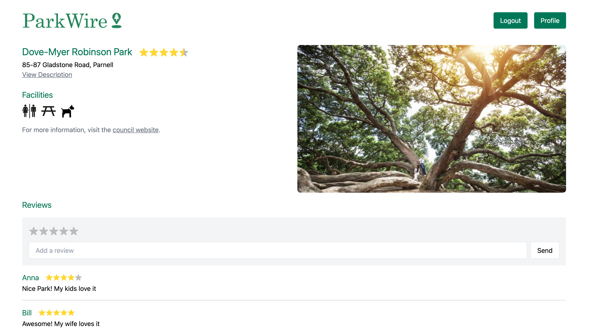
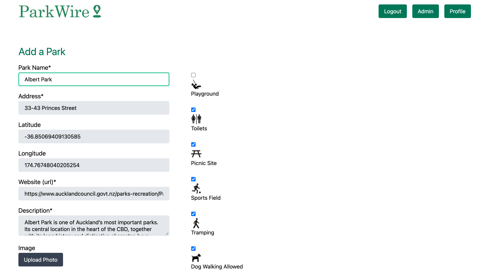

# Parks

> Explore and find your new favorite parks


### From the command line

```bash
npm install # to install dependencies
npm run knex migrate:latest # to reset database
npm run knex seed:run # to get seed data
npm run tailbuild # to build tailwind
npm run dev # to start the dev server
```

You can find the server running on [http://localhost:3000](http://localhost:3000).


## User Stories (from highest priority)
1. As a member, I want to view a map of parks
    - Main page displays a map with clickable parks which will lead to park details page
2. As a member, I want to view a park details page
    - Park Details will display information as well as a rating, comments, photos
3. As a member, I want to rate a park
    - From the park details page, the user can select and update their rating
4. As a member, I want to track parks I have been to or want to go to
    - From the park details page, the user can select that they have been to a park or select that they want to go to a park
5. As a member, I want to see a "history" of visited parks and parks to visited
    - From the user's personal profile page, they can view lists of their visited/to visit parks
6. As a member, I want to be able to filter the map of parks
    - From the main page, the member can select filters for parks that meets their requirements
7. As a member, I want to suggest a park to be added
    - From the main page (when logged in), the member can open a page which has a form to add a park
8. As an admin, I want to be able to moderate and verify user park suggestions
    - From an admin page, the admin should see a list of user suggestions and select to accept or decline the new page


## User Interface

Landing Page|Main Page
------------------------------------|------------------------------
|

Park Details Page|Admin Page
------------------------------------|------------------------------
|

Add Park Page|About Page
------------------------------------|-------------------------------
|


## Tech Stack
**Client:** React, Redux, TailwindCSS

**Server:** Node, Express

**Auth:** Auth0


## Authors
- Sarah Smith

- Sina Kakhki - [@sina-kakhki](https://github.com/sina-kakhki)

- Jonathan Zhou - [@jonathan-zhou](https://github.com/jonathan-zhou)

- Johann Besas - [@johannbesas](https://github.com/johannbesas)

- Lory Costa - [@lory-costa](https://github.com/lory-costa)
